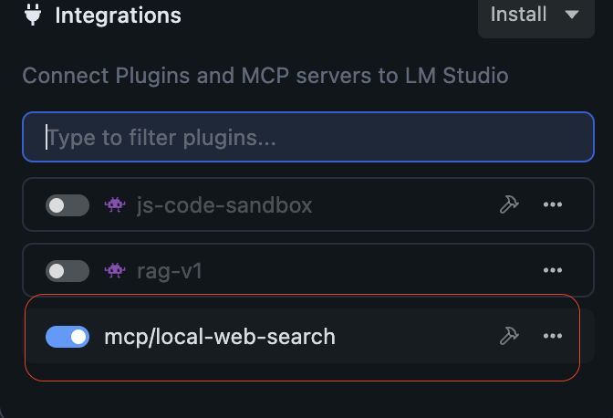

# Web Search MCP for LM Studio

A local web search server for LM Studio that enables AI models to search the web and retrieve content from web pages.

## Features

- Search the web using DuckDuckGo search engine
- Fetch and extract content from web pages
- Customizable search parameters (region, safesearch, time limits)
- Easy integration with LM Studio through MCP protocol

## Installation

### Prerequisites

- Python 3.12 or higher
- [uv](https://github.com/astral-sh/uv) package manager

### What is uv?

[uv](https://github.com/astral-sh/uv) is an extremely fast Python package installer and resolver, written in Rust. It's a replacement for pip and pip-tools with significant performance improvements.

### Installing uv

On macOS and Linux:
```bash
curl -LsSf https://astral.sh/uv/install.sh | sh
```

On Windows:
```bash
powershell -ExecutionPolicy ByPass -c "irm https://astral.sh/uv/install.ps1 | iex"
```

For other installation methods, see the [uv documentation](https://docs.astral.sh/uv/).

### Setup

1. Clone this repository:
```bash
git clone <repository-url>
cd web-search-lmstudio-mcp
```

2. Create a virtual environment and install dependencies:
```bash
uv venv --python 3.12
uv sync
```

## Configuration

Add the following configuration to your LM Studio `mcp.json` file:

```json
{
  "mcpServers": {
    "local-web-search": {
      "command": "python",
      "args": [
        "C:\\projects\\cloned\\web-search-mcp-lmstudio\\main.py"
      ]
    }
  }
}
```

**Note**: Replace `/absolute/path/to/web-search-lmstudio-mcp/` with the actual absolute path to your cloned repository.

## Usage

Once configured, the web search tools will be available in LM Studio:

1. **web_search**: Performs a web search with customizable parameters
2. **get_page_content**: Fetches and extracts text content from a given URL

The tools will appear in the MCP tools section of LM Studio and can be used by your AI models to access web information.



## Tools API

### web_search(query, num_results, region, safesearch, timelimit)
- `query`: Search terms
- `num_results`: Number of results to return (default: 10)
- `region`: Search region (e.g., 'us-en', 'uk-en', 'de-de')
- `safesearch`: Safety filter ('on', 'moderate', 'off')
- `timelimit`: Time constraint ('d', 'w', 'm', 'y')

### get_page_content(url)
- `url`: The URL of the page to fetch content from
